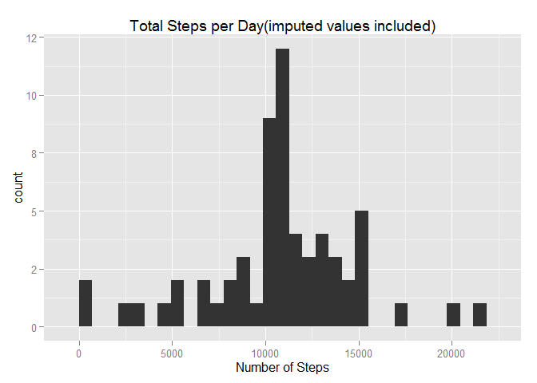

# Reproducible Research: Peer Assessment 1
Ed Marcarelli  
September 16, 2015

This report represents the output of Peer Assessment 1, Reproducible Research and uses the template provided for the assignment.


## Loading and preprocessing the data

```r
activity <- read.csv("activity.csv", stringsAsFactors = FALSE)
options(scipen = 6, digits = 1)
library(ggplot2)
library(dplyr, quietly = TRUE, warn.conflicts = FALSE)
```

## What is mean total number of steps taken per day?

```r
act_by_day <- summarize(group_by(activity, date), day_steps = sum(steps))

step_mn <- mean(act_by_day$day_steps, na.rm=TRUE)
step_md <- median(act_by_day$day_steps, na.rm=TRUE)
            
qplot(act_by_day$day_steps, geom="histogram", main = "Total Steps per Day" )+ labs(x = "Number of Steps")
```

 

###  Mean total steps per day: **10766.2**
###  Median total steps per day: **10765**


## What is the average daily activity pattern?


```r
## summarize data by interval across days
act_interim <- arrange(group_by(activity, interval, date))
act_by_int <- summarize(group_by(act_interim, interval), day_steps = mean(steps, na.rm=TRUE))
## plot time series by interval
ggplot(act_by_int, aes(interval,day_steps)) + geom_line()+ labs(y = "Number of Steps") +
      ggtitle("Average Steps by Interval")
```

 

```r
## find max interval
max_idx <- which.max(act_by_int$day_steps)
max_int <- act_by_int$interval[max_idx]
```
### The inteval with the highest average steps across days is **835**


## Imputing missing values

### Missing values Strategy
Missing values were imputed using the mean of the appropriate interval which was calculated in an earlier step   in the process. The activity data set was reprocessed and every time a missing value for steps was encountered, the mean corresponding to that interval value was retrieved and substituted. (See code for how this was done.)


```r
## Identify missing values
miss_vals <- apply(is.na(activity), 2, sum)

## Replace them with the mean
## of the appropriate interval (previously calculated)
mis_steps <- is.na(activity$steps)
cnt <- length(mis_steps)
for (i in 1:cnt )
{ 
   if (mis_steps[i] == TRUE)
   {   
      idx <- match(activity$interval[i], act_by_int$interval)
     
      if (idx > 0) {
      activity$steps[i] <- act_by_int$day_steps[idx]}
               
      else { activity$steps[i] <- 0 }
   }
}
```

### Missing values for the activity dataset: Steps: **2304**, Interval: **0**, Date: **0**


```r
## Summarize by day with revised data
act_by_day_i <- summarize(group_by(activity, date), day_steps = sum(steps))
stepi_mn <- mean(act_by_day_i$day_steps)
stepi_md <- median(act_by_day_i$day_steps)
            
qplot(act_by_day_i$day_steps, geom="histogram",main = "Total Steps per Day(imputed values included)") + 
      labs(x = "Number of Steps")
```

 

### Mean total steps per day: **10766.2**
### Median total steps per day: **10766.2**

**Observation:** *Imputing the missing values had only a minor effect on the median and no effect on the mean.*


## Are there differences in activity patterns between weekdays and weekends?


```r
## Using the data with imputed missing values, create factor variable for weekend/weekday

activity$day <- weekdays(as.POSIXlt(activity$date))
act_wkdy <- mutate(activity, wkdy = ifelse(day == "Sunday" | day == "Saturday", "Weekend", 
                                    ifelse( day == "Monday" | day == "Tuesday" | day == "Wednesday" | 
                                          day == "Thursday" | day == "Friday", "Weekday", 0)))
act_wkdy$wkdy <- factor(act_wkdy$wkdy)
act_wkdy_int <- summarize(group_by(act_wkdy, interval, wkdy), day_steps = mean(steps, na.rm=TRUE))

ggplot(act_wkdy_int, aes(interval,day_steps)) + geom_line() + facet_grid(wkdy ~ . ) + 
      labs(y = "Number of Steps") + ggtitle("Average Steps by Interval - Comparing Weekday to Weekend")
```

 
  
**Observation:** *Weekend activity is somewhat more evenly distributed across the 5-miunte intervals.*


### End of Report
