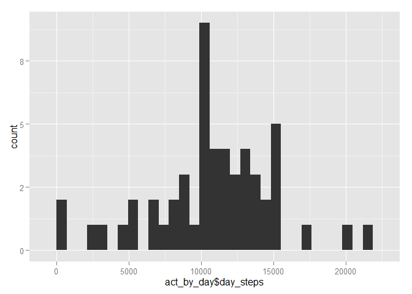

# Reproducible Research: Peer Assessment 1


## Loading and preprocessing the data

```r
activity <- read.csv("activity.csv", stringsAsFactors = FALSE)
```

## What is mean total number of steps taken per day?

```r
options(scipen = 6, digits = 1)
library(ggplot2)
library(dplyr, quietly = TRUE, warn.conflicts = FALSE)
act_by_day <- summarize(group_by(activity, date), day_steps = sum(steps))
step_mn <- mean(act_by_day$day_steps, na.rm=TRUE)
step_md <- median(act_by_day$day_steps, na.rm=TRUE)
            
qplot(act_by_day$day_steps, geom="histogram" )
```

 

### => Mean total steps per day: 10766.2 
### => Median total steps per day: 10765

## What is the average daily activity pattern?


## Imputing missing values


## Are there differences in activity patterns between weekdays and weekends?
